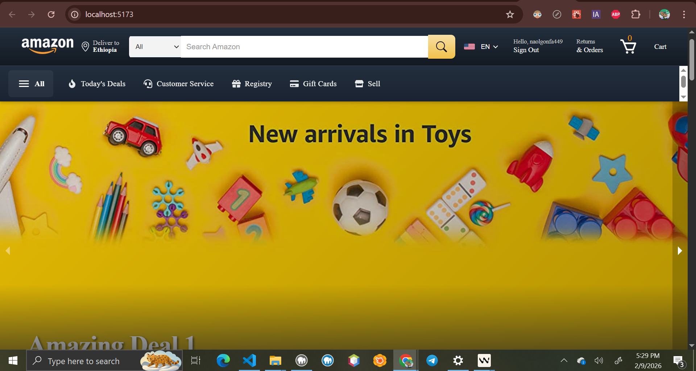
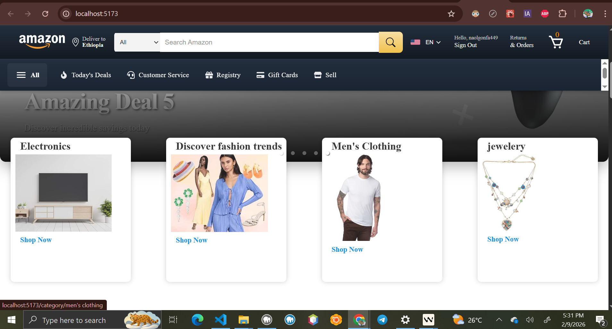
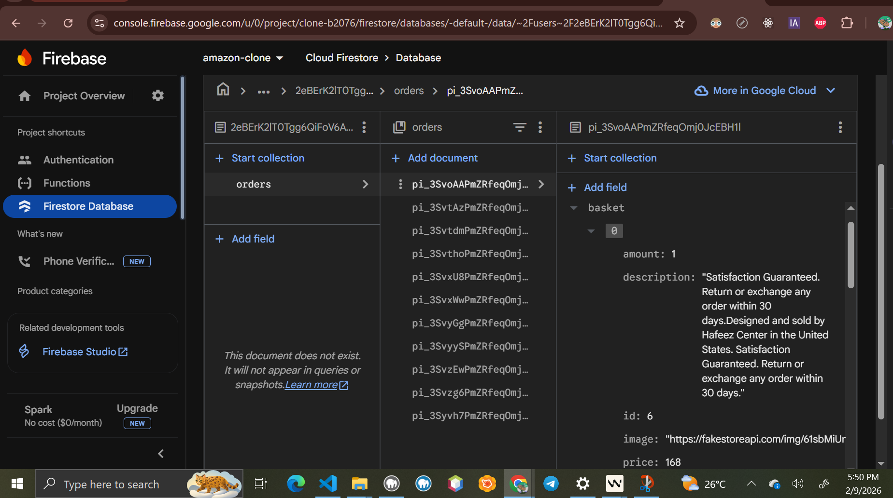
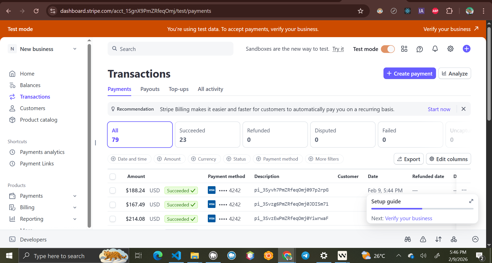
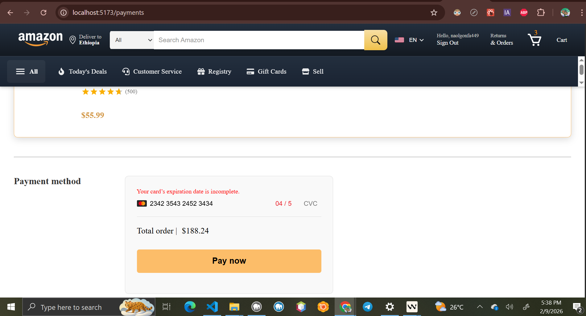

# Ecommerce Website - Full-Stack E-commerce Application

<div align="center">
  <h1>🛒 Modern E-commerce Platform</h1>
  
  []
  []
  []
  [](https://firebase.google.com/)
  [](https://stripe.com/)
  [](LICENSE)
</div>

## 🚀 Live Demo

🌐 **[View Live Application](https://naol724.github.io/React-Ecommerce-App)**

## 📋 Table of Contents

- [Overview](#overview)
- [Features](#features)
- [Tech Stack](#tech-stack)
- [Project Structure](#project-structure)
- [Installation](#installation)
- [Configuration](#configuration)
- [Usage](#usage)
- [Responsive Design](#responsive-design)
- [API Integration](#api-integration)
- [Authentication](#authentication)
- [Payment Integration](#payment-integration)
- [Deployment](#deployment)
- [Contributing](#contributing)
- [License](#license)

## 🎯 Overview

A fully functional e-commerce website built with React and modern web technologies. This e-commerce application provides a complete shopping experience with user authentication, product browsing, cart management, secure payments, and order tracking. The application is fully responsive and optimized for all device sizes from mobile phones (320px) to large desktop screens.

### Key Highlights

- 🛒 **Complete E-commerce Functionality**
- 🔐 **Secure Authentication with Firebase**
- 💳 **Payment Processing with Stripe**
- 📱 **Fully Responsive Design (320px - 1920px+)**
- 🔍 **Advanced Product Search & Filtering**
- 📦 **Order Management System**
- 🎨 **Modern UI/UX Design**
- ⚡ **Fast Performance with Vite**

## ✨ Features

### 🏪 Core E-commerce Features

- **Product Catalog**: Browse thousands of products with detailed information
- **Category Navigation**: Organized product categories for easy browsing
- **Product Search**: Advanced search functionality with real-time results
- **Product Details**: Comprehensive product pages with images, descriptions, and reviews
- **Shopping Cart**: Add, remove, and manage items with quantity controls
- **Wishlist**: Save products for later purchase
- **Order History**: Track past orders and purchase history

### 🔐 User Management

- **User Registration**: Create new accounts with email verification
- **User Login**: Secure authentication with Firebase
- **Profile Management**: Update user information and preferences
- **Protected Routes**: Secure access to user-specific features
- **Password Reset**: Forgot password functionality

### 💰 Payment & Checkout

- **Secure Checkout**: Multi-step checkout process
- **Payment Processing**: Integration with Stripe for secure payments
- **Multiple Payment Methods**: Support for credit cards and digital wallets
- **Order Confirmation**: Email confirmations and order tracking
- **Invoice Generation**: Detailed purchase receipts

### 📱 Responsive Design

- **Mobile-First Approach**: Optimized for mobile devices
- **Cross-Device Compatibility**: Works on phones, tablets, and desktops
- **Touch-Friendly Interface**: Optimized for touch interactions
- **Adaptive Layouts**: Dynamic layouts based on screen size
- **Performance Optimized**: Fast loading on all devices

### 🎨 User Experience

- **Modern UI Design**: Clean and intuitive interface
- **Smooth Animations**: Engaging micro-interactions
- **Loading States**: Visual feedback during data loading
- **Error Handling**: Graceful error messages and recovery
- **Accessibility**: WCAG compliant design

## 🛠 Tech Stack

### Frontend

- **React 19.2.0** - Modern React with latest features
- **Vite 7.2.4** - Fast build tool and development server
- **React Router DOM 7.10.1** - Client-side routing
- **CSS Modules** - Scoped styling solution
- **Material-UI 7.3.6** - UI component library
- **React Icons 5.5.0** - Icon library

### Backend & Services

- **Firebase 12.7.0** - Authentication and database
- **Stripe 8.6.0** - Payment processing
- **Axios 1.13.2** - HTTP client for API calls

### Development Tools

- **ESLint** - Code linting and formatting
- **Vite** - Build tool and development server
- **GitHub Pages** - Deployment platform

### Additional Libraries

- **React Responsive Carousel 3.2.23** - Image carousel component
- **React Spinners 0.17.0** - Loading indicators
- **Numeral 2.0.6** - Number formatting
- **Styled Components 6.1.19** - CSS-in-JS styling

## 📁 Project Structure

```
ecommerce-website/
├── public/
│   └── Amazon_icon.svg.svg
├── src/
│   ├── Api/
│   │   ├── axios.js              # Axios configuration
│   │   └── endPoints.jsx         # API endpoints
│   ├── Components/
│   │   ├── Carousel/             # Image carousel component
│   │   ├── Category/             # Product categories
│   │   ├── CurrencyFormat/       # Price formatting
│   │   ├── DataProvider/         # Context API provider
│   │   ├── Header/               # Navigation header
│   │   ├── LayOut/               # Page layout wrapper
│   │   ├── Loader/               # Loading components
│   │   ├── Product/              # Product components
│   │   └── ProtectedRoute/       # Route protection
│   ├── Pages/
│   │   ├── Auth/                 # Authentication pages
│   │   ├── Cart/                 # Shopping cart
│   │   ├── Landing/              # Home page
│   │   ├── Orders/               # Order history
│   │   ├── Payment/              # Checkout & payment
│   │   ├── ProductDetail/        # Product details
│   │   ├── Products/             # Product listings
│   │   └── Results/              # Search results
│   ├── Utility/
│   │   ├── action.Type.js        # Redux action types
│   │   ├── firebase.js           # Firebase configuration
│   │   └── reducer.js            # State management
│   ├── App.jsx                   # Main app component
│   ├── main.jsx                  # App entry point
│   ├── Router.jsx                # Route configuration
│   └── index.css                 # Global styles
├── functions/                    # Firebase Cloud Functions
├── dist/                         # Build output
├── .firebaserc                   # Firebase configuration
├── firebase.json                 # Firebase hosting config
├── package.json                  # Dependencies
└── vite.config.js               # Vite configuration
```

## 🚀 Installation

### Prerequisites

- **Node.js** (v16 or higher)
- **npm** or **yarn**
- **Git**

### Step 1: Clone the Repository

```bash
git clone https://github.com/Naol724/React-Ecommerce-App.git
cd React-Ecommerce-App
```

### Step 2: Install Dependencies

```bash
npm install
```

### Step 3: Install Firebase Functions Dependencies

```bash
cd functions
npm install
cd ..
```

## ⚙️ Configuration

### Firebase Setup

1. Create a Firebase project at [Firebase Console](https://console.firebase.google.com/)
2. Enable Authentication and Firestore Database
3. Create a `.env` file in the root directory:

```env
VITE_FIREBASE_API_KEY=your_api_key
VITE_FIREBASE_AUTH_DOMAIN=your_auth_domain
VITE_FIREBASE_PROJECT_ID=your_project_id
VITE_FIREBASE_STORAGE_BUCKET=your_storage_bucket
VITE_FIREBASE_MESSAGING_SENDER_ID=your_sender_id
VITE_FIREBASE_APP_ID=your_app_id
```

### Stripe Setup

1. Create a Stripe account at [Stripe Dashboard](https://dashboard.stripe.com/)
2. Get your publishable key and add to your environment:

```env
VITE_STRIPE_PUBLISHABLE_KEY=pk_test_your_stripe_key
```

### Firebase Functions Environment

Create `functions/.env` file:

```env
STRIPE_SECRET_KEY=sk_test_your_stripe_secret_key
```

## 🎮 Usage

### Development Mode

```bash
npm run dev
```

The application will be available at `http://localhost:5173`

### Build for Production

```bash
npm run build
```

### Preview Production Build

```bash
npm run preview
```

### Deploy to GitHub Pages

```bash
npm run deploy
```

### Firebase Functions Deployment

```bash
firebase deploy --only functions
```

## 📱 Responsive Design

The application is fully responsive and optimized for all device sizes:

### Breakpoints

- **Mobile**: 320px - 480px
- **Tablet**: 481px - 768px
- **Desktop**: 769px - 1024px
- **Large Desktop**: 1025px+

### Key Responsive Features

- **Flexible Grid Layouts**: Adaptive product grids
- **Mobile Navigation**: Collapsible header elements
- **Touch-Friendly**: Optimized for touch interactions
- **Responsive Images**: Properly scaled product images
- **Mobile-First CSS**: Optimized loading and performance

### Testing Devices

- iPhone SE (320px)
- iPhone 12 (390px)
- iPad (768px)
- iPad Pro (1024px)
- Desktop (1200px+)

## 🔌 API Integration

### Product Data

The application uses the [Fake Store API](https://fakestoreapi.com/) for product data:

- Product listings
- Category information
- Product details
- User reviews

### Custom Endpoints

```javascript
// API endpoints configuration
const BASE_URL = "https://fakestoreapi.com";

export const productUrl = "/products";
export const categoryUrl = "/products/categories";
export const singleProductUrl = "/products/";
```

## 🔐 Authentication

### Firebase Authentication Features

- **Email/Password Authentication**
- **User Registration with Email Verification**
- **Password Reset Functionality**
- **Protected Routes**
- **Persistent Login Sessions**

### Authentication Flow

1. User registers with email and password
2. Firebase sends verification email
3. User verifies email and can log in
4. JWT token stored for session management
5. Protected routes check authentication status

## 💳 Payment Integration

### Stripe Payment Features

- **Secure Card Processing**
- **Multiple Payment Methods**
- **Real-time Payment Validation**
- **Order Confirmation**
- **Receipt Generation**

### Payment Flow

1. User adds items to cart
2. Proceeds to secure checkout
3. Enters payment information
4. Stripe processes payment securely
5. Order confirmation and receipt

### Supported Payment Methods

- Credit Cards (Visa, MasterCard, American Express)
- Debit Cards
- Digital Wallets (Apple Pay, Google Pay)

## 🚀 Deployment

### GitHub Pages Deployment

The application is automatically deployed to GitHub Pages:

1. **Build the application**:

   ```bash
   npm run build
   ```

2. **Deploy to GitHub Pages**:
   ```bash
   npm run deploy
   ```

### Firebase Hosting (Alternative)

```bash
firebase init hosting
firebase deploy
```

### Environment Variables for Production

Ensure all environment variables are properly set in your deployment platform:

- Firebase configuration
- Stripe keys
- API endpoints

## 🧪 Testing

### Manual Testing Checklist

- [ ] User registration and login
- [ ] Product browsing and search
- [ ] Add/remove items from cart
- [ ] Checkout process
- [ ] Payment processing
- [ ] Order history
- [ ] Responsive design on all devices

### Browser Compatibility

- Chrome 60+
- Firefox 55+
- Safari 12+
- Edge 79+

## 🔧 Troubleshooting

### Common Issues

**Build Errors**:

```bash
# Clear node modules and reinstall
rm -rf node_modules package-lock.json
npm install
```

**Firebase Connection Issues**:

- Verify Firebase configuration
- Check environment variables
- Ensure Firebase project is active

**Stripe Payment Issues**:

- Verify Stripe keys are correct
- Check test mode vs live mode
- Ensure webhook endpoints are configured

## 🤝 Contributing

We welcome contributions! Please follow these steps:

1. **Fork the repository**
2. **Create a feature branch**: `git checkout -b feature/amazing-feature`
3. **Commit changes**: `git commit -m 'Add amazing feature'`
4. **Push to branch**: `git push origin feature/amazing-feature`
5. **Open a Pull Request**

### Development Guidelines

- Follow React best practices
- Use CSS Modules for styling
- Write meaningful commit messages
- Test on multiple devices
- Ensure responsive design

## 📄 License

This project is licensed under the MIT License - see the [LICENSE](LICENSE) file for details.

## 👨‍💻 Author

**Naol Getachew**

- GitHub: [@Naol724](https://github.com/Naol724)
- LinkedIn: [Naol Gonfa](https://linkedin.com/in/naol-gonfa)

## 🙏 Acknowledgments

- **React Team** for the amazing framework
- **Firebase** for backend services
- **Stripe** for payment processing
- **Fake Store API** for product data
- **Material-UI** for UI components
- **Vite** for the build tool

## 📞 Support

If you have any questions or need help with the project:

1. **Check the documentation** in this README
2. **Search existing issues** on GitHub
3. **Create a new issue** with detailed information
4. **Contact the author** through GitHub

---

<div align="center">
  <p>Made with ❤️ by <a href="https://github.com/Naol724">Naol Gonfa</a></p>
  <p>⭐ Star this repository if you found it helpful!</p>
</div>
